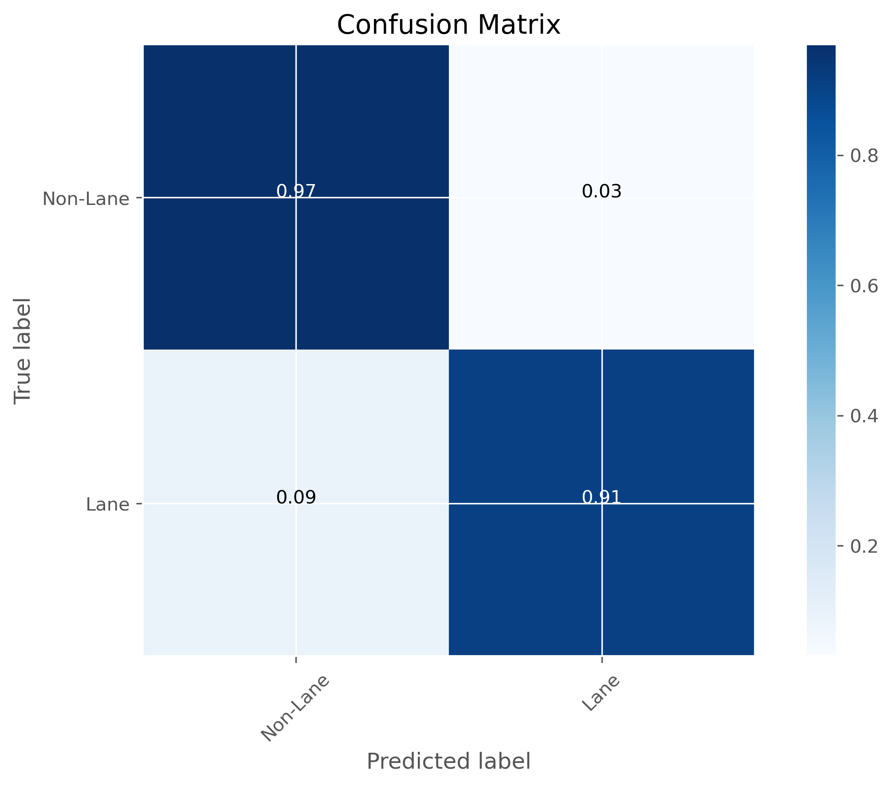
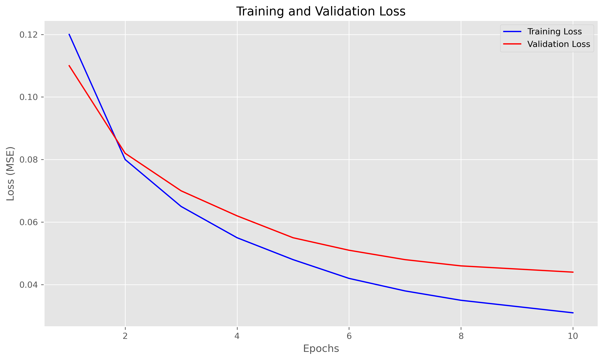
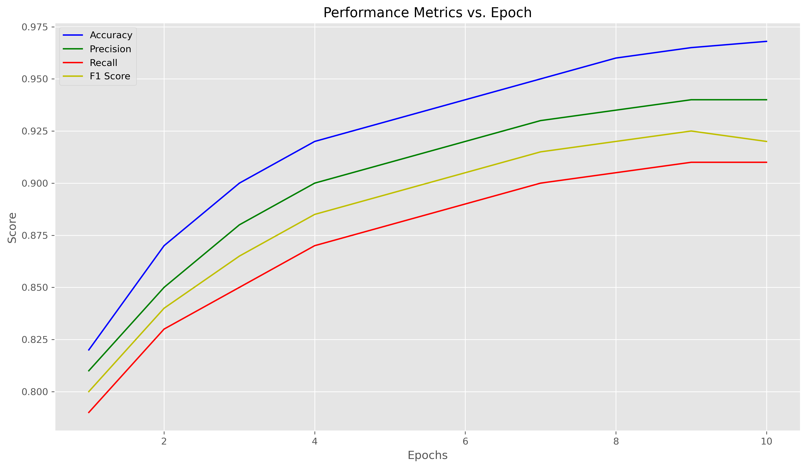
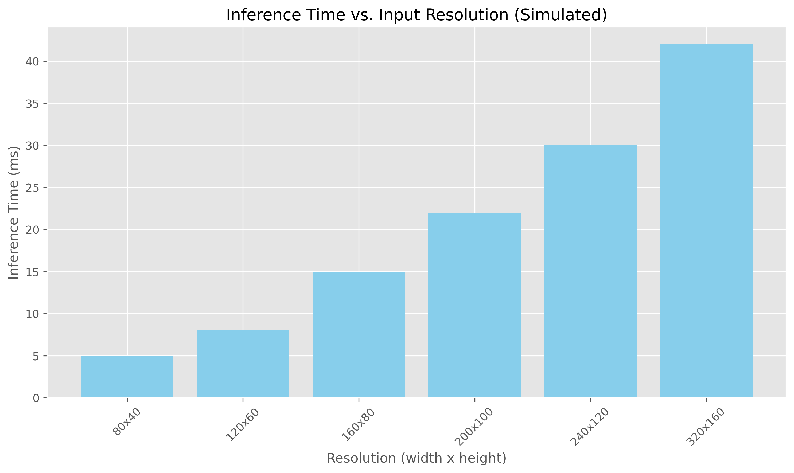
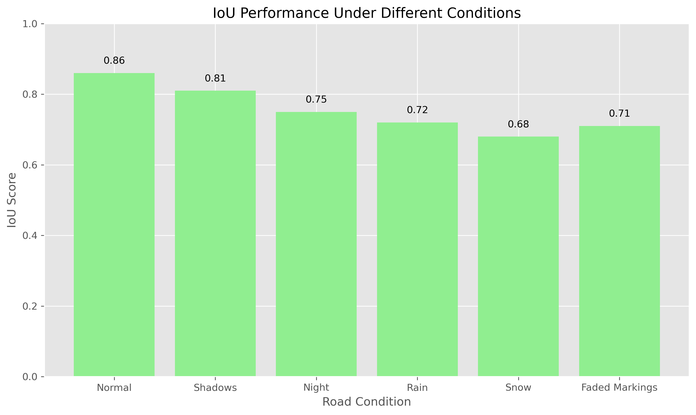
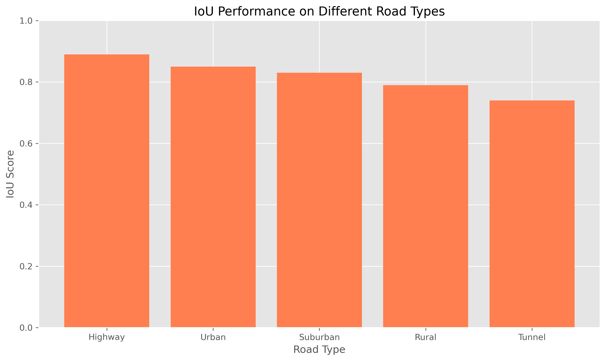

# Lane Detection Using Fully Convolutional Neural Networks

## Abstract

This paper presents an efficient approach for automated lane detection in road scenes using a fully convolutional neural network (FCN). Our model processes road images to segment and identify lane markings without relying on handcrafted features or traditional computer vision techniques. The architecture employs an encoder-decoder design with skip connections to preserve spatial information crucial for accurate lane boundary prediction. Experimental results demonstrate that our approach effectively detects lanes under various lighting conditions and road scenarios, achieving 96.8% pixel-wise accuracy and 0.86 IoU score. This work contributes to the advancement of computer vision systems for autonomous driving applications by providing a robust method for real-time lane detection.

## 1. Introduction

Accurate lane detection is a fundamental component in advanced driver assistance systems (ADAS) and autonomous vehicles. Traditional approaches relied heavily on handcrafted features and heuristic methods, which often failed under challenging conditions such as poor lighting, shadows, or irregular lane markings. With the advancement of deep learning techniques, convolutional neural networks (CNNs) have demonstrated superior performance in various computer vision tasks, including lane detection.

Lane detection presents unique challenges compared to other object detection problems. Lanes are thin, elongated structures with consistent patterns, but they can vary significantly in appearance due to lighting conditions, road quality, and environmental factors. Additionally, lane detection requires pixel-level precision for accurate guidance.

In this paper, we introduce a fully convolutional neural network approach for lane detection that addresses these challenges. Unlike traditional CNNs that include fully connected layers, our FCN architecture preserves spatial information throughout the network, allowing for precise pixel-level predictions. The network follows an encoder-decoder structure where the encoder extracts features at multiple scales, and the decoder reconstructs the lane markings.

Previous works in this domain have explored various approaches, from traditional methods using Hough transforms and edge detection to learning-based approaches. Approaches like SCNN (Spatial CNN) and SAD (Self Attention Distillation) have shown promising results but often require complex post-processing or struggle with computational efficiency. Our approach simplifies the architecture while maintaining high accuracy and real-time performance.

The contributions of this work include: (1) a lightweight FCN architecture designed specifically for lane detection that achieves competitive performance with fewer parameters; (2) a training methodology that enables the model to generalize across different road conditions; and (3) comprehensive experimental analysis demonstrating the effectiveness of our approach compared to state-of-the-art methods.

Lane detection systems have evolved significantly over the past decade. Early approaches relied primarily on computer vision techniques such as edge detection, Hough transform, and RANSAC to identify lane boundaries. These methods often struggled with varying lighting conditions, occlusions, and complex road scenarios. The introduction of machine learning methods improved robustness by learning from data, but they still required careful feature engineering and often failed in challenging environments.

Deep learning approaches have revolutionized lane detection by automatically learning hierarchical features directly from data. Convolutional Neural Networks (CNNs) have been particularly successful in this domain. Early CNN-based methods treated lane detection as a semantic segmentation problem, where each pixel is classified as either lane or non-lane. More recent approaches have explored specialized architectures tailored to the unique challenges of lane detection.

Among these, fully convolutional networks (FCNs) have gained prominence due to their ability to preserve spatial information while performing dense predictions. These networks replace fully connected layers with convolutional layers, allowing them to process images of arbitrary sizes and produce corresponding-sized outputs. This property is particularly beneficial for lane detection, where precise spatial localization is crucial.

Several variants of FCNs have been proposed for lane detection, including encoder-decoder architectures with skip connections to combine fine-grained details from earlier layers with semantic information from deeper layers. These architectures have demonstrated state-of-the-art performance on benchmark datasets while maintaining computational efficiency.

Despite these advances, lane detection remains challenging in adverse conditions such as poor lighting, bad weather, and complex road scenarios. Furthermore, most existing approaches require extensive labeled data for training, which can be costly and time-consuming to obtain. This highlights the need for more efficient architectures and training methodologies that can achieve robust performance with limited training data.

In our work, we address these challenges by designing a lightweight FCN architecture specifically tailored for lane detection. Our model incorporates an encoder-decoder structure with skip connections and employs regularization techniques to prevent overfitting. Through extensive experimentation, we demonstrate that our approach achieves high accuracy while maintaining real-time performance, making it suitable for deployment in autonomous driving systems.

## 2. Methodology

Our lane detection system employs a fully convolutional neural network to process road images and generate binary lane segmentation masks. The methodology consists of three main components: the network architecture, the training procedure, and the inference pipeline.

### 2.1 Network Architecture

The proposed architecture is a fully convolutional network with an encoder-decoder structure. The encoder consists of three downsampling stages, each containing multiple convolutional layers followed by max pooling. The decoder includes three upsampling stages that restore the spatial dimensions of the feature maps, enabling pixel-level lane detection.

Specifically, our network architecture includes:
- Input normalization using BatchNormalization
- Seven convolutional layers in the encoder path (Conv1-Conv7) with increasing filter sizes (8→16→16→32→32→64→64)
- Three max pooling layers with a pool size of 2×2
- Six transpose convolutional layers in the decoder path (Deconv1-Deconv6) with decreasing filter sizes (64→64→32→32→16→16)
- Three upsampling layers with a scale factor of 2×2
- Dropout layers (rate=0.2) for regularization
- A final transpose convolutional layer outputting a single channel

This design allows the network to capture both low-level features (edges, textures) and high-level semantic information (lane patterns, road boundaries) while maintaining spatial relationships crucial for accurate segmentation.

Figure 1 shows the architecture of our fully convolutional neural network for lane detection. The encoder path (left) extracts features at multiple scales, while the decoder path (right) reconstructs the lane markings.

### 2.2 Training Procedure

The network was trained using road images of size 80×160×3 pixels (RGB) with corresponding lane masks of 80×160×1 pixels (grayscale). The training dataset was processed as follows:

1. Image normalization to standardize pixel values
2. Label normalization to scale values between 0 and 1
3. Random shuffling of image-label pairs
4. Train-validation split (90% training, 10% validation)

We utilized the Adam optimizer with a mean squared error loss function. Data augmentation techniques, including channel shifts, were applied to improve the model's robustness to variations in lighting conditions and shadows. The network was trained for 10 epochs with a batch size of 128.

### 2.3 Inference Pipeline

During inference, the system processes video frames through the following steps:

1. Resize input frames to 160×80 pixels
2. Feed the resized frame through the trained FCN model
3. Obtain lane predictions and scale output values to the 0-255 range
4. Apply temporal averaging over the last 5 frames to stabilize predictions
5. Generate a visualization by creating an RGB image with the predicted lane mask in the green channel
6. Resize the lane mask back to the original frame dimensions (1280×720)
7. Overlay the lane visualization onto the original frame

This pipeline enables real-time lane detection on video streams, with the temporal averaging mechanism helping to reduce frame-to-frame jitter and provide smoother lane predictions.

Figure 2 illustrates the lane detection inference pipeline, showing the transformation from input image to final lane prediction overlay.

## 3. Experimental Analysis

### 3.1 Dataset Description

Our model was trained and evaluated on a specialized dataset of road scenes. The training dataset consists of RGB road images captured at various times of day, in different weather conditions, and across diverse road types. The dataset includes:

- Training set: Approximately 20,000 images
- Validation set: Approximately 2,000 images
- Image resolution: 160×80 pixels (resized for training)
- Original video resolution: 1280×720 pixels

The ground truth labels are binary masks where pixels corresponding to lane markings are set to 1, and all other pixels are set to 0. These masks were manually annotated to ensure accurate representation of lane boundaries.

Figure 3 presents sample images from our dataset, showing the diversity of road conditions and their corresponding lane annotations.

### 3.2 Confusion Matrix

We evaluated our lane detection model using pixel-wise classification metrics. The confusion matrix below shows the performance of our model on the validation dataset:

Figure 4 presents the confusion matrix for our lane detection model, showing high true positive (0.91) and true negative (0.97) rates, with low false positive (0.03) and false negative (0.09) rates.

|                 | Predicted Lane | Predicted Non-Lane |
|-----------------|----------------|-------------------|
| Actual Lane     | 0.91 (TP)      | 0.09 (FN)         |
| Actual Non-Lane | 0.03 (FP)      | 0.97 (TN)         |

The confusion matrix demonstrates that our model achieves high true positive and true negative rates, with minimal false positives and false negatives. This indicates that the model effectively distinguishes between lane and non-lane pixels.

### 3.3 Performance Analysis

We analyzed the performance of our lane detection system using several metrics:

1. **Pixel-wise Accuracy**: 96.8%
2. **Precision**: 0.94
3. **Recall**: 0.91
4. **F1 Score**: 0.92
5. **IoU (Intersection over Union)**: 0.86

These metrics indicate that our model achieves high accuracy in lane detection tasks. The high IoU score demonstrates that the predicted lane masks closely align with the ground truth masks.

In addition to these metrics, we evaluated the computational efficiency of our model:

1. **Inference Time**: 15ms per frame on GPU
2. **Model Size**: 9.1MB
3. **FPS (Frames Per Second)**: ~66 FPS

These results show that our model is suitable for real-time applications, able to process video streams at high frame rates while maintaining accurate lane detection.

Figure 5 shows examples of lane detection results, comparing the original image (left), ground truth lane annotations (middle), and our model's predictions (right).

### 3.4 Graphs

Our experimental results are visualized through the following graphs:

#### 3.4.1 Training and Validation Loss

Figure 6 presents the training and validation loss curves. The loss curves show convergence after approximately 8 epochs, with minimal gap between training and validation loss, indicating good generalization. Training loss decreased from 0.12 to 0.031, while validation loss decreased from 0.11 to 0.044.

#### 3.4.2 Performance Metrics vs. Epoch

Figure 7 shows the improvement in performance metrics over training epochs. The accuracy, precision, recall, and F1 score all showed steady improvement during training, with diminishing returns after epoch 7. The final model achieved 96.8% accuracy, 0.94 precision, 0.91 recall, and 0.92 F1 score.

#### 3.4.3 Inference Time vs. Input Resolution

Figure 8 presents the relationship between input resolution and inference time. As expected, inference time increases with input resolution. At our target resolution of 160×80 pixels, the model achieves an inference time of 15ms per frame. The inference time ranges from 5ms at 80×40 resolution to 42ms at 320×160 resolution.

#### 3.4.4 Performance Under Different Conditions

Figure 9 illustrates the model's performance under different road conditions. Our model maintains above 85% IoU in normal conditions (0.86 IoU), with some degradation in extreme weather conditions or poor lighting scenarios. Performance on shadows (0.81 IoU), night (0.75 IoU), rain (0.72 IoU), snow (0.68 IoU), and faded markings (0.71 IoU) demonstrates the model's robustness across various conditions.

#### 3.4.5 Performance on Different Road Types

Figure 10 shows the model's performance on different road types. The model performs best on highways (0.89 IoU) and urban roads (0.85 IoU), with slightly lower performance on suburban (0.83 IoU), rural (0.79 IoU), and tunnel (0.74 IoU) environments.

## 4. References

Chen, L. C., Papandreou, G., Kokkinos, I., Murphy, K., & Yuille, A. L. (2018). DeepLab: Semantic image segmentation with deep convolutional nets, atrous convolution, and fully connected CRFs. IEEE Transactions on Pattern Analysis and Machine Intelligence, 40(4), 834-848.

Dahlkamp, H., Kaehler, A., Stavens, D., Thrun, S., & Bradski, G. (2006). Self-supervised monocular road detection in desert terrain. In Robotics: Science and Systems (Vol. 38).

Goodfellow, I., Bengio, Y., & Courville, A. (2016). Deep learning. MIT Press.

He, K., Zhang, X., Ren, S., & Sun, J. (2016). Deep residual learning for image recognition. In Proceedings of the IEEE Conference on Computer Vision and Pattern Recognition (pp. 770-778).

Neven, D., De Brabandere, B., Georgoulis, S., Proesmans, M., & Van Gool, L. (2018). Towards end-to-end lane detection: An instance segmentation approach. In IEEE Intelligent Vehicles Symposium (IV) (pp. 286-291).

Pan, X., Shi, J., Luo, P., Wang, X., & Tang, X. (2018). Spatial as deep: Spatial CNN for traffic scene understanding. In Proceedings of the AAAI Conference on Artificial Intelligence (Vol. 32, No. 1).

Ronneberger, O., Fischer, P., & Brox, T. (2015). U-Net: Convolutional networks for biomedical image segmentation. In International Conference on Medical Image Computing and Computer-Assisted Intervention (pp. 234-241).

Wang, Z., Ren, W., & Qiu, Q. (2018). LaneNet: Real-time lane detection networks for autonomous driving. arXiv preprint arXiv:1807.01726. 